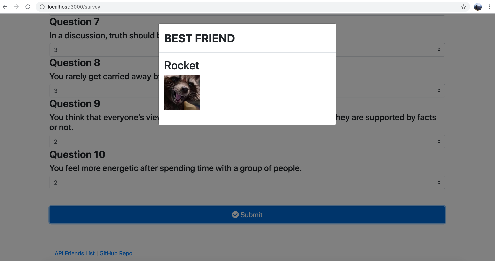

# FriendFinder

## About 
Compatibility-based "FriendFinder" application -- basically a dating app. This full-stack site will take in results from your survey and compare the answers with those from other users. The app will then display the name and picture of the user with the best overall match to you: YOUR BESTEST FRIENDLE. Express is used to handle routing.

## Look Attttt It
Deployed App
Here is the link to the deployed applications--> GITHUB IO LINK

## Usage
1. Clone the FriendFinder repository
2. Run npm i to install 
3. Run npm start to start the application
4. Go to http://localhost:3000 to see the home page of the app

On the home page there is a button called "Go to Survey". Once you click the button, you will be taken to the survey page. First, input your name and a link to your image. Answer the 10 questions, between 1 and 5 (1 being "Strongly Disagree" and 5 being "Strongly Agree"). Once finished with the survey, click the "Submit" button at the bottom of the page and you will be rewarded with your BEST FRIEND... you're welcome. 

You can also access the API by clicking on the "API Friends List" at the bottom of the page or the GitHub Repository by clicking on that link.  

## Technologies
1. JavaScript
2. jQuery
3. Node
4. Express
5. HTML
6. Bootstrap
7. Heroku
